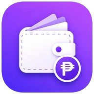

<div align="center">



# 💜 Spendie

### Your Smart Personal Finance Tracker

*Track every peso. Plan every month. Grow every day.*

[](https://spendieapp.vercel.app)
[](https://expo.dev)
[](https://supabase.com)
[](https://vercel.com)
[](https://spendieapp.vercel.app)

</div>

---

## 📖 What is Spendie?

**Spendie** is a mobile-first personal finance app built for everyday Filipinos (₱). It goes beyond simple expense logging — it helps you **understand** your spending patterns, **forecast** your future balance, **track** your bills and subscriptions, **gamify** your money habits, and receive **AI-powered coaching** that adapts to your personality.

Whether you're budgeting solo or managing finances with a partner, Spendie keeps everything in one beautifully themed, premium-feel app.

---

## ✨ Features at a Glance

<table>
<tr>
<td width="50%">

### 🏠 Home — Overview
- Running balance card with **Focus Mode** (blur toggle)
- Monthly income / expenses / saved breakdown
- `‹ Month Year ›` navigator for any past month
- Smart financial alerts & personality-aware insights
- **Streak System** — Logging · No-Spend · Budget
- **🤗 AI Financial Coach** with 6 personalities
- **📸 Memory Cards** — "1 year ago today..."
- **🏅 Community Challenges** — Join & track progress

</td>
<td width="50%">

### 💸 Log — Transactions
- Calendar + timeline feed — tap any day to filter
- Daily income + expense totals per day group
- Color-coded category icons & PH-timezone timestamps
- 24 categories across 6 groups
- Recurring transactions with specific day scheduling
- **😬 Regret Purchase Tracker** — Rate each expense
- **💸 Payday Celebration** — Confetti on income!

</td>
</tr>
<tr>
<td width="50%">

### 🎯 Plan — Bills, Subs & Goals
- Bills tracker: 🔴 Overdue · 🟠 Upcoming · ✅ Paid
- Subscription manager with 15 quick-add presets
- Monthly subscription cost total + renewal urgency
- Budget categories with visual progress bars
- Savings goals with timeline projector

</td>
<td width="50%">

### 📊 Trends — Analytics & Forecast
- Monthly calendar with income/expense/bill dots
- **4-month Cash Flow Forecast** chart
- Category Trends — month-vs-month % change
- Monthly income vs expenses bar chart
- Pie chart breakdown by spending category

</td>
</tr>
<tr>
<td width="50%">

### 👤 Profile — Achievements, Wrapped & Settings
- **🎬 Annual Wrapped** — 12-slide yearly financial story
- **🎬 Monthly Wrapped** — End-of-month recap
- **18 achievement badges** across 5 categories
- **Spending Personality** engine (7 types)
- Net Worth tracker — cash, savings, investments, debts
- Multi-user **Spaces** for couples & households
- **⚙️ Settings Panel** — all preferences in one place

</td>
<td width="50%">

### 🎨 14 Visual Themes
**Standard:** 💜 Violet · ⬜ Minimal · 🌸 Pastel · 🌺 Sakura · 💹 Finance · 🌑 AMOLED · ⚡ Cyberpunk · 🖥️ Terminal

**Seasonal (auto):** 🎄 Christmas · 🎃 Halloween · 💕 Valentine's · 🌅 Summer · 🌧️ Rainy Day · 🎆 New Year

> Seasonal themes auto-activate by calendar date (Philippines schedule)

</td>
</tr>
</table>

---

## 🆕 What's New — Latest Update

### 🤗 AI Coach — Personality-Aware Everything
The AI Coach now adapts its tone across **every surface** it appears on:

- **Insights** — The "Coach Caught This" section generates messages specific to each of the 6 personalities (supportive, strict, roast, analyst, anime, minimal)
- **Transaction comments** — Logging a transaction triggers a comment that's aware of the category, amount, time of day, and budget proximity
- **Plan item comments** — Adding a budget, goal, bill, or recurring transaction generates a relevant, personality-matched coaching nudge
- **Zero balance handling** — ₱0.00 balance mid-month is now specifically detected and addressed with a personality-appropriate response

| Personality | Vibe |
|---|---|
| 🤗 Supportive Coach | Warm, encouraging, growth-mindset |
| ⚔️ Budget Guardian | Firm, no-nonsense, disciplined |
| 🎤 Roast Mode | Funny, viral-style spending commentary |
| 📊 Corporate Analyst | Data-driven, KPI-speak |
| ⚡ Anime Mentor | Dramatic power-level energy |
| 🍃 Calm Minimalist | Short, zen, distraction-free |

### 🗓️ Recurring Transaction Day Picker
Recurring transactions now let you specify the **exact schedule** — not just frequency:

| Frequency | Picker |
|---|---|
| **Monthly** | Visual 31-day grid — tap the day of the month |
| **Weekly** | 7-chip day-of-week selector (Sun–Sat) |
| **Semi-monthly** | Two separate day pickers |

The app computes the correct `next_run` date automatically and displays human-readable labels like "Every 15th", "Every Monday", "15th & 30th" in the recurring list.

### 🔔 Push Notifications
Full local push notification system via `expo-notifications`:

| Notification | Trigger |
|---|---|
| 📅 Bill Reminder | 3 days before due date |
| 📝 Daily Logging Reminder | 8:00 PM every day |
| 📊 Weekly Budget Check-In | Sunday 10:00 AM |
| 🚨 Budget Exceeded | Immediately when a category limit is crossed |
| ⚠️ Low Balance Alert | Immediately when balance drops below ₱1,000 |
| 🎉 Payday Alert | Immediately on income ≥ ₱5,000 |

Toggle the daily reminder and weekly check-in on/off in **Settings → Notifications**.

### ✏️ Edit-Only UI (Delete Inside Modal)
All list views now show only an **Edit** button. The **Delete** action lives inside the edit modal — reducing accidental deletions and keeping the UI clean. Applied across:
- Transactions
- Budgets
- Goals
- Bills
- Recurring transactions

### 🕐 Philippine Timezone — Fully Consistent
All date bucketing, streak calculations, calendar dots, and time displays now explicitly use **Asia/Manila (UTC+8)** via the `timezone.js` utility — regardless of the user's device timezone. This ensures correct behavior for users on web or devices not set to PH time.

### ⚙️ Settings Panel — Updated
- **Notifications section** — Daily reminder + weekly budget check-in toggles
- Removed redundant **Roast Mode** toggle (use the Coach Personality selector instead — pick 🎤 Roast Mode there)

---

## 🆕 Previous Major Update

### 💸 Payday Celebration
Whenever a new income transaction is logged for today, a 24-particle confetti animation fires with a glowing banner — once per transaction, never repeats. Can be toggled off in Settings.

### 🌫️ Focus Mode
Tap the 👁️ eye icon on the Balance Card to blur all financial values. Great for screen-sharing, reducing anxiety, or just keeping things private in public. Persists across sessions.

### 🎬 Annual Wrapped
A Spotify Wrapped-style 12-slide story of your full financial year — income, expenses, biggest purchase, best saving month, no-spend days, spending personality, and goal achievements. Supports multi-year history with a year chip picker. Each slide is shareable.

### 😬 Regret Purchase Tracker
Rate every expense as **👍 Worth It**, **😐 Neutral**, or **😬 Regret**. The app then generates:
- Regret ratio percentage
- Most-regretted category
- Late-night spending pattern detection
- Satisfaction insights ("Food brings you the most joy")

### 🏅 Community Challenges
Join 8 finance challenges and track auto-calculated progress:

| Challenge | Goal | Difficulty |
|---|---|---|
| 🚫 No Spend Week | 7 no-expense days | Hard |
| 💰 ₱500 Saver Sprint | Save ₱500 this month | Easy |
| ☕ Coffee-Free Week | No café purchases for 7 days | Medium |
| 📝 7-Day Logging Streak | Log daily for a week | Easy |
| 🎯 Full Month In-Budget | Zero budget overruns | Hard |
| 🛡️ Emergency Fund Sprint | Save ₱1,000 | Medium |
| 🍱 Cook It Week | No food delivery for 7 days | Medium |
| 🛍️ No Shopping Month | Zero shopping for 30 days | Expert |

### 📸 Memory Cards
Horizontal-scroll nostalgic financial flashbacks:
- "One year ago today, you spent ₱X on..."
- "Six months ago..." snapshots
- First transaction milestones (30, 60, 90, 180, 365 days)
- Year-over-year comparison ("You spent 23% LESS than last May!")
- Best saving month in the past 12 months

### 🌍 Seasonal Auto-Themes
6 seasonal themes auto-activate based on Philippines calendar:

| Season | Window |
|---|---|
| 🎆 New Year | Jan 1–7 |
| 💕 Valentine's | Feb 1–14 |
| 🌅 Summer | Mar 15 – Jun 15 |
| 🌧️ Rainy Day | Jun 16 – Sep 30 |
| 🎃 Halloween | October |
| 🎄 Christmas | Nov 25 – Jan 7 |

---

## 🗂️ Detailed Feature Breakdown

<details>
<summary><strong>🏠 Home Tab — Overview & Streaks</strong></summary>

<br>

| Feature | Description |
|---|---|
| **Running Balance Card** | Gradient card showing all-time net balance with Focus Mode blur |
| **Month Summary** | Monthly income, expenses, and saved — updates with navigator |
| **Month Navigator** | `‹ May 2026 ›` — browse any past month; "This Month" badge on current |
| **Smart Alerts** | Auto-warns when near or over budget limits |
| **Spending Insights** | Auto-generated, personality-aware tips based on actual spending patterns |
| **Logging Streak 📝** | Consecutive days with ≥1 transaction logged |
| **No-Spend Streak 🚫** | Consecutive days with zero expense transactions |
| **Budget Streak 🛡️** | Days this month where no budget category was exceeded |
| **AI Coach** | Personality-aware comment + zero-balance detection + daily tip |
| **Memory Cards** | Horizontal-scroll nostalgic financial flashbacks |
| **Community Challenges** | Browse and join finance challenges with live progress |

</details>

<details>
<summary><strong>💸 Log Tab — Transactions & Regret Tracker</strong></summary>

<br>

| Feature | Description |
|---|---|
| **Calendar + Timeline** | Unified view — tap any calendar day to filter the timeline below |
| **Day Headers** | Each group shows daily income + expense totals |
| **Color-coded icons** | Each category has a unique color icon on the timeline |
| **PH Time stamps** | Always shown in Asia/Manila timezone regardless of device |
| **Add / Edit / Delete** | Full CRUD — delete lives inside the edit modal |
| **Custom Emoji** | Override the default category icon per transaction |
| **Recurring engine** | Auto-inserts overdue recurring entries on login |
| **Regret Tracker** | Rate each expense: 👍 Worth It · 😐 Neutral · 😬 Regret |
| **Regret Analytics** | Regret ratio %, top regret category, late-night pattern insights |

**24 Categories across 6 groups:**

| Group | Categories |
|---|---|
| 💰 Income | Salary · Freelance · Business |
| 🍔 Daily | Food · Transportation · Shopping · Health · Entertainment · Games |
| 🏠 Bills | Bills · Rent · Utilities · Internet · Insurance · Loan |
| 🔄 Subscriptions | Subscriptions |
| 📈 Financial | Savings · Investment |
| 🎒 Misc | Education · Travel · Gifts · Other |

</details>

<details>
<summary><strong>🎯 Plan Tab — Bills, Subscriptions & Goals</strong></summary>

<br>

**Bills & Due Dates**

| Feature | Description |
|---|---|
| **3 status groups** | 🔴 Overdue · 🟠 Upcoming · ✅ Paid this cycle |
| **Mark as paid** | One-tap to mark a bill done |
| **Recurring bills** | Monthly / quarterly / annual frequency |
| **Notes field** | Store account numbers and references |
| **Summary chips** | Overdue count · upcoming count · total unpaid amount |
| **Bill reminders** | Push notification 3 days before due date |

**Subscription Manager — 15 Quick-Add Presets**

`Netflix` · `Spotify` · `YouTube Premium` · `Disney+` · `Amazon Prime` · `Apple Music` · `HBO Max` · `Canva Pro` · `Adobe CC` · `Microsoft 365` · `Google One` · `iCloud` · `Gym` · `Internet` · `Phone Plan`

| Feature | Description |
|---|---|
| **Auto-detection** | Typing a service name fills emoji, category & subscription flag |
| **Renewal urgency** | 🔴 Overdue · 🟠 Within 3 days · 🔵 Within 7 days · 🟢 7+ days |
| **Monthly total** | Banner shows total monthly subscription spend + count |

**Recurring Transactions**

| Frequency | Day picker |
|---|---|
| Monthly | Visual 31-day grid |
| Weekly | 7-chip day-of-week selector |
| Semi-monthly | Two day pickers |
| Daily | No day picker needed |

**Savings Goals**

| Feature | Description |
|---|---|
| **Progress bar** | Visual fill with % label |
| **Deadline urgency** | Days/months remaining label; red when ≤7 days |
| **📅 Plan button** | Timeline modal showing savings plan options (₱500–₱5,000/mo) |
| **Required monthly** | Calculates how much/month is needed to hit the deadline |

</details>

<details>
<summary><strong>📊 Trends Tab — Analytics & Forecasting</strong></summary>

<br>

| Feature | Description |
|---|---|
| **Monthly Calendar** | Full grid; 🟢 income · 🔴 expense · 🟠 bill-due dots per day |
| **Day tap → filter** | Timeline below filters to selected day's transactions |
| **Cash Flow Forecast** | 4-month forward projection (history + recurring + bills) |
| **Category Trends** | Month-vs-month % change with ↑↓ arrows; "New" badge for first-time categories |
| **Monthly Trend Chart** | Bar chart of income vs expenses over time |
| **Pie & Bar Charts** | Spending breakdown by category |

**How Cash Flow Forecast works:**
1. Starts from current all-time running balance
2. Applies average monthly income/expenses from last 3 months
3. Factors in all bills due in each projected month
4. Adjusts for all recurring transaction net amounts
5. Shows green (up) or red (down) trend line with % change badge

</details>

<details>
<summary><strong>👤 Profile Tab — Wrapped, Achievements & Settings</strong></summary>

<br>

**🎬 Annual Wrapped (12 slides)**

| Slide | Content |
|---|---|
| 1 | Welcome — year overview with transaction count |
| 2 | Total income earned |
| 3 | Total expenses |
| 4 | Net savings + savings rate |
| 5 | Biggest single expense |
| 6 | #1 spending category |
| 7 | Best saving month |
| 8 | Most active tracking month |
| 9 | No-spend days count |
| 10 | Spending personality |
| 11 | Goals completed |
| 12 | Forward-looking outro |

> Supports multi-year history — pick any year via chip selector. Each slide is shareable.

**18 Achievement Badges**

| Category | Badges |
|---|---|
| 🚀 Getting Started | 👶 First Step · 🎯 Budget Boss · 🌟 Goal Setter · 📝 Getting Serious · ⚡ Power Tracker |
| 🔥 Consistency | 🔥 3-Day Streak · 💪 Week Warrior · 👑 Monthly Master · 🚫 Frugal Start |
| 💰 Savings | 🌱 Quarter Way · 🏆 Goal Crusher · 💚 In the Green |
| 🛡️ Budgeting | 🛡️ Budget Hero · 🏗️ Budget Architect |
| 📋 Planning | 🔁 Automate It · 🧾 Bill Tracker · 📦 Subscription Aware |

> Achievements are computed client-side via `useMemo` — no extra DB calls needed.

**Net Worth Tracker**

| Feature | Description |
|---|---|
| **4 input fields** | 💵 Cash on Hand · 🏦 Savings/Bank · 📈 Investments · 💸 Debts |
| **Live preview** | Net worth = cash + savings + investments − debts |
| **Daily snapshots** | One entry per day — builds history automatically |
| **History chart** | Line chart of last 6 snapshots |
| **Change tracking** | Shows ₱ amount + % change vs previous snapshot |

**⚙️ Settings Panel**

| Section | Options |
|---|---|
| **Appearance** | Theme picker · Seasonal auto-theme toggle · Focus Mode |
| **AI Coach** | Personality chip selector (6 options) |
| **Celebrations** | Payday confetti animation toggle |
| **Insights** | Memory cards toggle · Regret tracker toggle |
| **Notifications** | Daily logging reminder (8 PM) · Weekly budget check-in (Sun 10 AM) |

</details>

---

## 🛠️ Tech Stack

| Layer | Technology |
|---|---|
| **Framework** | React Native + Expo SDK 54 |
| **Web target** | Expo Web (Metro bundler) → PWA |
| **Backend / DB** | Supabase (PostgreSQL + Auth + Realtime) |
| **Hosting** | Vercel |
| **Push Notifications** | expo-notifications (Android channels + web fallback) |
| **Charts** | react-native-chart-kit |
| **Icons** | lucide-react-native |
| **Theming** | React Context + AsyncStorage (14 themes) |
| **State** | React hooks (useState · useMemo · useEffect · useRef) |
| **Offline** | AsyncStorage queue → sync on reconnect |
| **Animations** | React Native Animated API (no external lib) |

---

## 📁 Project Structure

```
Spendie/
├── App.js                          # Root — ThemeProvider + SettingsProvider + auth + notifications
├── app.json                        # Expo config: PWA meta, icons, splash
├── vercel.json                     # Vercel build + SPA rewrite rules
├── public/
│   ├── manifest.json               # Web app manifest
│   └── sw.js                       # Service worker (network-first HTML, SWR assets)
└── src/
    ├── lib/
    │   ├── theme.js                # Color, spacing, radius, typography, shadow tokens
    │   ├── themes.js               # 14 theme presets + detectSeasonalTheme()
    │   ├── ThemeContext.jsx        # useTheme() + auto seasonal switching
    │   ├── SettingsContext.jsx     # useSettings() — all user preferences (AsyncStorage)
    │   ├── constants.js            # Nav tabs, app-wide constants
    │   ├── categoryConfig.js       # 24 categories + subscription presets
    │   ├── supabaseClient.js       # Native Supabase client
    │   ├── supabaseClient.web.js   # Web Supabase client
    │   ├── timezone.js             # Philippine timezone helpers (Asia/Manila)
    │   ├── alertsEngine.js         # Smart financial alerts
    │   ├── insightsEngine.js       # Personality-aware spending insights
    │   ├── coachEngine.js          # 6 AI coach personalities + dynamic comments
    │   ├── pushNotifications.js    # Local push notifications (bill/budget/payday alerts)
    │   ├── roastEngine.js          # Spending roast generator (safety-moderated)
    │   ├── challengesData.js       # 8 challenge definitions + progress calculators
    │   ├── memoryEngine.js         # Nostalgic financial memory card generator
    │   ├── regretStore.js          # AsyncStorage regret ratings + analytics
    │   ├── spendingPersonality.js  # 7 spending personality types
    │   ├── achievementsEngine.js   # 18 badge definitions + unlock logic
    │   ├── recurringEngine.js      # Auto-processes overdue recurring transactions
    │   └── offlineQueue.js         # Offline transaction queue
    ├── screens/
    │   ├── LoginScreen.jsx
    │   ├── RegisterScreen.jsx
    │   └── DashboardScreen.jsx     # All data fetching, state, business logic
    └── components/
        ├── common/
        │   ├── Header.jsx
        │   ├── BottomNavigation.jsx    # Premium pill-style with spring animations
        │   ├── FloatingAddButton.jsx
        │   ├── MonthNavigator.jsx
        │   ├── ThemePicker.jsx
        │   ├── PaydayCelebration.jsx   # 24-particle confetti celebration
        │   ├── NotificationBell.jsx
        │   ├── AppLoader.jsx
        │   └── ConfirmModal.jsx
        ├── dashboard/
        │   ├── BalanceCard.jsx         # Gradient card + Focus Mode blur + animation
        │   ├── StreakCard.jsx           # Logging / no-spend / budget streaks (PH timezone)
        │   ├── CoachSection.jsx        # AI coach display + personality picker modal
        │   ├── ChallengesSection.jsx   # Community challenges browser + progress
        │   ├── MemoryCards.jsx         # Horizontal nostalgic memory cards
        │   ├── RegretSection.jsx       # Transaction rating UI + regret analytics
        │   ├── AnnualWrapped.jsx       # 12-slide yearly recap with year picker
        │   ├── SettingsModal.jsx       # In-app settings panel
        │   ├── CalendarTransactionsSection.jsx  # Unified calendar + timeline
        │   ├── BillsSection.jsx
        │   ├── SubscriptionSection.jsx
        │   ├── BudgetSection.jsx
        │   ├── GoalsSection.jsx        # Goals with timeline projector modal
        │   ├── RecurringSection.jsx    # Recurring list with day/frequency labels
        │   ├── CalendarView.jsx
        │   ├── CashFlowForecast.jsx    # 4-month balance projection chart
        │   ├── CategoryTrends.jsx      # Month-vs-month category comparison
        │   ├── AnalyticsSection.jsx
        │   ├── MonthlyTrendChart.jsx
        │   ├── MonthlyReview.jsx       # End-of-month Wrapped (day 30/31)
        │   ├── AchievementsSection.jsx
        │   ├── NetWorthSection.jsx
        │   ├── SpendingPersonality.jsx
        │   ├── SpacesSection.jsx
        │   ├── MembersSection.jsx
        │   └── QuickInfoSection.jsx
        └── modals/
            ├── TransactionModal.jsx    # Add/edit with delete inside modal
            ├── RecurringModal.jsx      # Day-of-month grid + day-of-week chips
            ├── BillsModal.jsx
            ├── BudgetModal.jsx
            ├── GoalModal.jsx
            ├── SpaceModal.jsx
            └── InviteModal.jsx
```

---

## 🗄️ Database Schema

<details>
<summary><strong>View all tables</strong></summary>

<br>

### `profiles`
| Column | Type | Notes |
|---|---|---|
| id | uuid | FK → auth.users |
| full_name | text | |
| email | text | |

### `spaces`
| Column | Type | Notes |
|---|---|---|
| id | uuid | PK |
| name | text | |
| type | text | `'personal'` or `'shared'` |
| owner_id | uuid | FK → profiles |
| emoji | text | |

### `space_members`
| Column | Type | Notes |
|---|---|---|
| space_id | uuid | FK → spaces |
| user_id | uuid | FK → profiles |

### `transactions`
| Column | Type | Notes |
|---|---|---|
| id | uuid | PK |
| space_id | uuid | FK → spaces |
| created_by | uuid | FK → profiles |
| type | text | `'income'` or `'expense'` |
| amount | numeric | |
| category | text | |
| description | text | nullable |
| emoji | text | nullable — custom icon override |
| created_at | timestamptz | stored UTC; displayed in Asia/Manila |

### `recurring_transactions`
| Column | Type | Notes |
|---|---|---|
| id | uuid | PK |
| space_id | uuid | FK → spaces |
| type | text | `'income'` or `'expense'` |
| amount | numeric | |
| category | text | |
| description | text | nullable |
| emoji | text | nullable |
| frequency | text | `daily` / `weekly` / `monthly` / `semi_monthly` |
| next_run | date | computed from frequency + day selection |
| is_subscription | boolean | default false |
| subscription_service | varchar(100) | nullable |
| recurring_day | smallint | day of month for monthly (1–31) |
| recurring_weekday | smallint | day of week for weekly (0=Sun … 6=Sat) |
| recurring_day_1 | int | for semi-monthly: first day |
| recurring_day_2 | int | for semi-monthly: second day |

> **Migration required** if upgrading from an earlier version:
> ```sql
> ALTER TABLE recurring_transactions
>   ADD COLUMN IF NOT EXISTS recurring_day     smallint DEFAULT NULL,
>   ADD COLUMN IF NOT EXISTS recurring_weekday smallint DEFAULT NULL;
> ```

### `bills`
| Column | Type | Notes |
|---|---|---|
| id | uuid | PK |
| space_id | uuid | FK → spaces |
| name | varchar(200) | |
| amount | decimal | |
| due_date | date | |
| is_paid | boolean | default false |
| is_recurring | boolean | default false |
| frequency | varchar(50) | nullable |
| emoji | varchar(10) | nullable |
| notes | text | nullable |

### `net_worth_entries`
| Column | Type | Notes |
|---|---|---|
| id | uuid | PK |
| user_id | uuid | FK → profiles |
| snapshot_date | date | unique per user per day |
| cash | decimal | |
| savings | decimal | |
| investments | decimal | |
| debts | decimal | |
| notes | text | nullable |

### `budgets` · `goals` · `notifications`
> Standard tables for budget limits, savings goals, and in-app notifications with deduplication via `dedupe_key`.

> **Note:** Regret ratings and app settings are stored locally in AsyncStorage — no additional DB tables needed.

</details>

---

## 🚀 Getting Started

### Prerequisites

- Node.js 18+
- Expo CLI — `npm install -g expo-cli`
- A [Supabase](https://supabase.com) project

### 1. Clone & install

```bash
git clone https://github.com/Haniel023/Spendie.git
cd Spendie
npm install
```

### 2. Environment variables

Create a `.env` file in the project root:

```env
EXPO_PUBLIC_SUPABASE_URL=your_supabase_project_url
EXPO_PUBLIC_SUPABASE_ANON_KEY=your_supabase_anon_key
```

> `.env` is gitignored — never commit real credentials.

### 3. Run SQL migrations

Run in **Supabase Dashboard → SQL Editor**:

```sql
-- Base schema (transactions, budgets, goals, bills, recurring, spaces)
-- See supabase/migrations/ for full migration files

-- Required if upgrading: add recurring day columns
ALTER TABLE recurring_transactions
  ADD COLUMN IF NOT EXISTS recurring_day     smallint DEFAULT NULL,
  ADD COLUMN IF NOT EXISTS recurring_weekday smallint DEFAULT NULL;
```

### 4. Run locally

```bash
# Browser (PWA)
npx expo start --web

# Mobile via Expo Go
npx expo start
```

### 5. Deploy to Vercel

```bash
npx vercel --prod
```

---

## 📱 Install as PWA

**iOS (Safari only)**
1. Open [spendieapp.vercel.app](https://spendieapp.vercel.app) in Safari
2. Tap **Share → Add to Home Screen**
3. Opens fullscreen — no browser chrome

**Android (Chrome)**
1. Open the URL in Chrome
2. Tap ⋮ → **Add to Home Screen** (or accept the install prompt)

---

## ⚙️ Service Worker Cache Strategy

| Request | Strategy |
|---|---|
| `*.supabase.co` | Bypass — always live |
| HTML navigation | Network-first, fallback to cached shell |
| JS / fonts / images | Stale-while-revalidate |

Cache key: `spendie-v1` — bump to `spendie-v2` in `public/sw.js` on breaking changes.

---

## 🔒 Local-Only Data

Some features are stored on-device only (no DB required):

| Feature | Storage Key | Contents |
|---|---|---|
| App settings | `@spendie_settings_v2` | Coach personality, Focus Mode, Challenges, Notification prefs, etc. |
| Regret ratings | `@spendie_regret_ratings_v1` | `{ [transactionId]: 'worth_it' \| 'neutral' \| 'regret' }` |
| Theme preference | `@spendie_theme` | Active theme ID |
| Achievement timestamps | `@spendie_achievement_timestamps` | First unlock dates |

---

<div align="center">

Made with 💜 by [Haniel023](https://github.com/Haniel023)

*Every peso tracked. Every goal within reach.*

</div>
